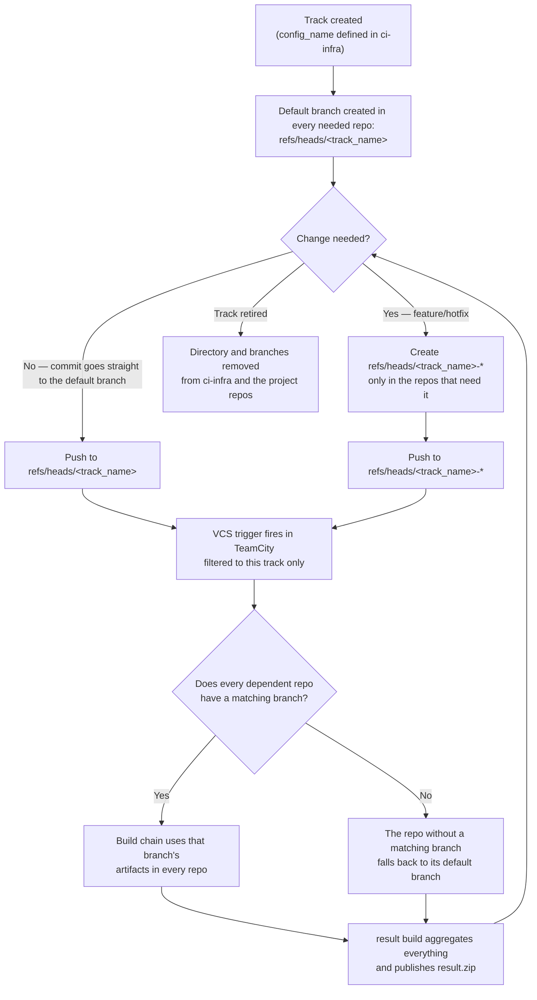
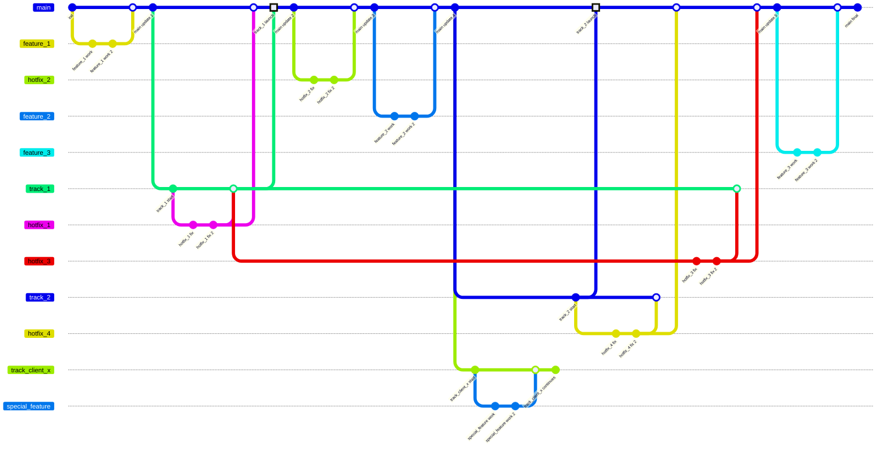

🇬🇧 English · [🇷🇺 Русский](../ru/track.md) · [🇨🇳 中文](../zh/track.md)

# Track

A **track** is a group of the several projects needed to ship a track.

Organizing a track as its own directory makes it cheap to create a new track (copy and adjust an existing one), delete a track that's gone out of support, and keep tracks independent of one another.

## Contents

A track has a name. That name is consistent across GitLab and TeamCity.

The track's default branch is named `<track_name>`. Every other branch in git follows the pattern `<track_name>-*`. TeamCity's VCS roots use the same pattern.

A commit to a branch triggers a build in TeamCity; per the filter, only the build chain for that specific track runs. To make a change, the developer creates a branch with the same name in whichever repos they need it in. If a repo doesn't have a branch by that name, TeamCity takes artifacts from the default branch instead.

The `result` build is the track's overall result — it carries the trigger that fires builds based on VCS commits.

> Important!
> The track has the same name in GitLab, TeamCity, and git branches.
> Repos in GitLab and build configurations in TeamCity have the same names.

Matching names rule out confusion between the different services and make navigation fast. As a bonus, TeamCity's grouping and GitLab's repo nesting can mirror each other.

## Change diagram

## Tracks diagram

