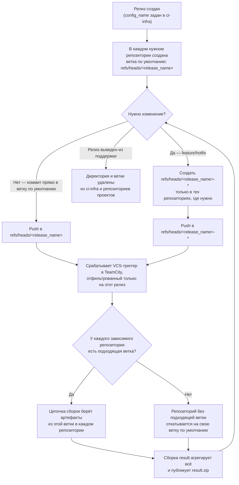
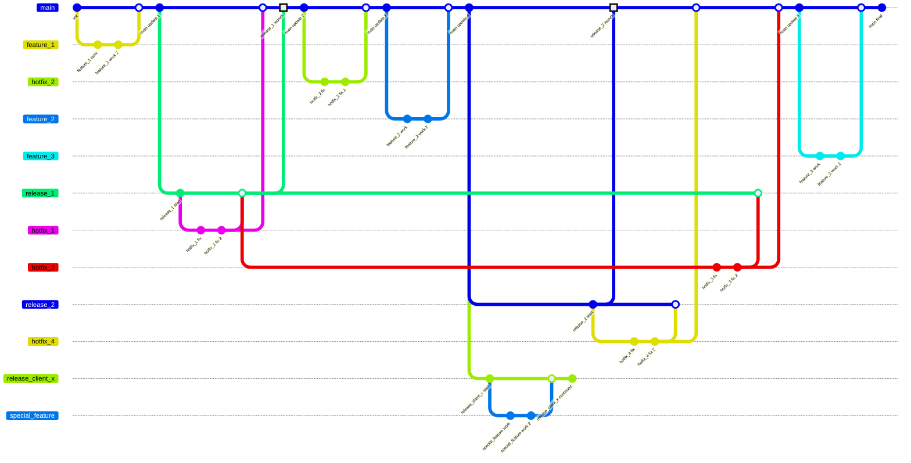

[🇬🇧 English](../en/release.md) · 🇷🇺 Русский · [🇨🇳 中文](../zh/release.md)

_Перевод `docs/en/release.md`. При изменении оригинала обновите и эту версию — см. [ADR 0006](adr/0006-trilingual-docs-mirror-tree.md)._

# Релиз

Релиз - группа нескольких проектов, необходимые для выпуска релиза.

Организация релиза в отдельную директорию необходима для простого создания нового релиза (путём копирования и изменения другого), удаления релиза, вышедшего из поддержки, и независимости одних релизов от других.

## Содержимое

Релиз имеет имя. Это имя согласуется с Gitlab и Teamcity.

Так ветка по умолчанию для релиза имеет имя `%release name%`. Имена, остальных веток в git, формируются по следующему шаблону `%release name%-*`. Тот же паттерн используется в VCS в Teamcity.

Коммит в ветку запускает сборку в Teamcity, согласно фильтру, запускается цепочка сборок только нужного релиза.
Для внесения изменений, создаётся ветка во всех, необходимых разработчику, репозиториях с одинаковым именем. При отсутствии такого имени в репозитории, Teamcity берёт артефакты из ветки по умолчанию.

Сборка `result` является результатом релиза, в ней находится триггер запуска сборок на основе коммитов в VCS.

> Важно!
> одинаковые названия у релиза в gitlab, teamcity и git branches.
> одинаковые названия у репозиториев в gitlab и конфигурации сборки в Teamcity.

Одинаковые имена исключают путаницу между разными сервисами и обеспечивают быструю навигацию. Дополнительно, можно отражать группами в Teamcity, вложенность репозиториев в Gitlab.

## Схема изменений

## Схема релизов

