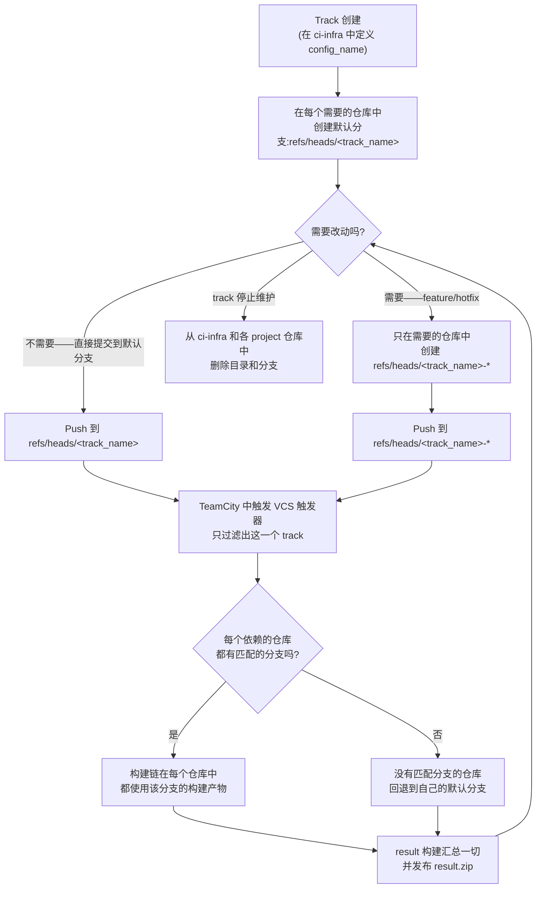
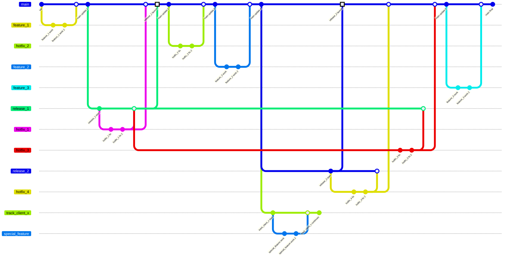

[🇬🇧 English](../en/track.md) · [🇷🇺 Русский](../ru/track.md) · 🇨🇳 中文

# Track

**Track** 是发布一个版本所需要的若干个项目的集合。

把 track 组织成独立的目录，是为了让创建新 track(复制并调整一个已有的)、删除已经停止维护的 track、以及让各个 track 互不影响都变得简单。

## 内容

Track 有自己的名字，这个名字在 GitLab 和 TeamCity 中保持一致。

Track 的默认分支名为 `<track_name>`。git 中其余的分支都遵循 `<track_name>-*` 这个命名模式，TeamCity 的 VCS root 用的是同一个模式。

向分支提交代码会触发 TeamCity 中的构建；根据过滤规则，只有这个 track 自己的构建链会被触发。要做修改，开发者需要在自己需要改动的那些仓库里，创建一个同名的分支。如果某个仓库里没有这个名字的分支，TeamCity 就会改用默认分支的构建产物。

`result` 构建是这个 track 的总体结果——触发它的，是基于 VCS 提交的触发器。

> 重要！
> track 在 GitLab、TeamCity 和 git 分支里用的是同一个名字。
> GitLab 里的仓库名和 TeamCity 里的 build configuration 名保持一致。

名字保持一致，可以避免在不同服务之间产生混淆，也让人能快速定位。这样做还有一个额外的好处：TeamCity 里的分组方式和 GitLab 里仓库的嵌套结构可以互相对应。

## 变更流程图

## Track 关系图

